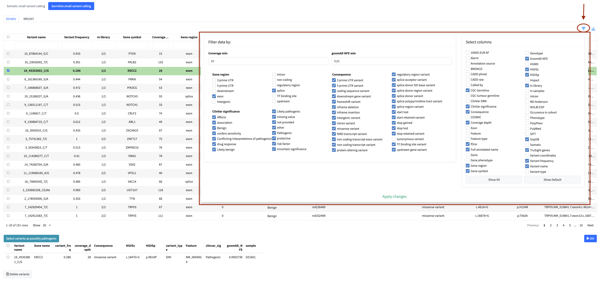
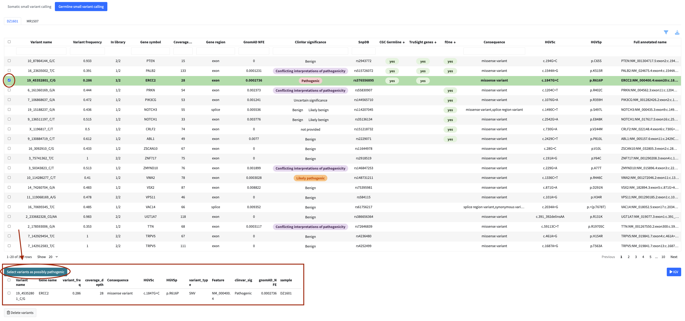
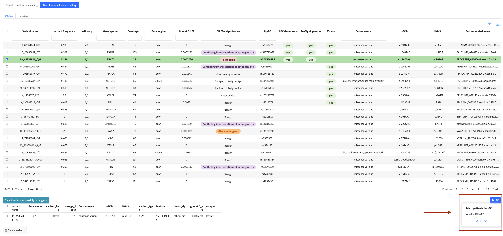
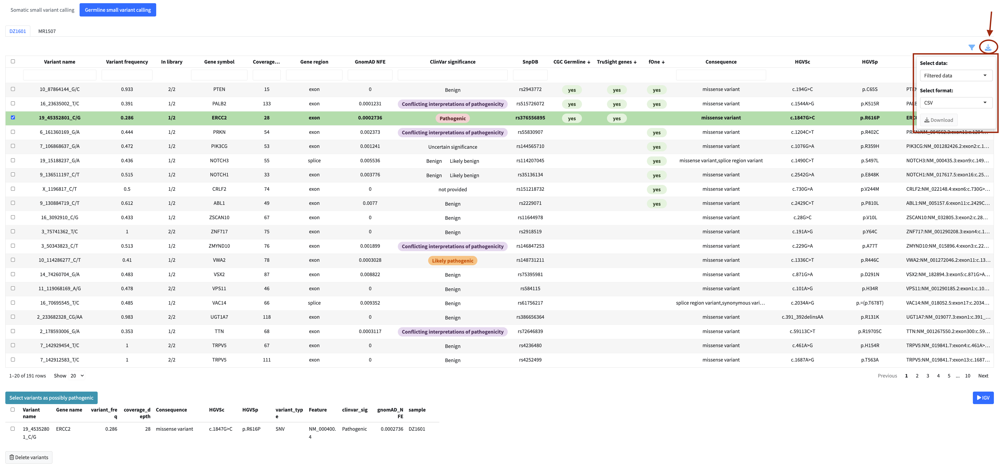
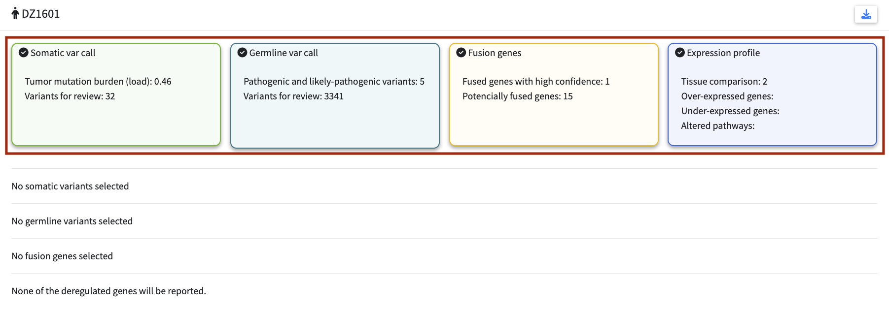
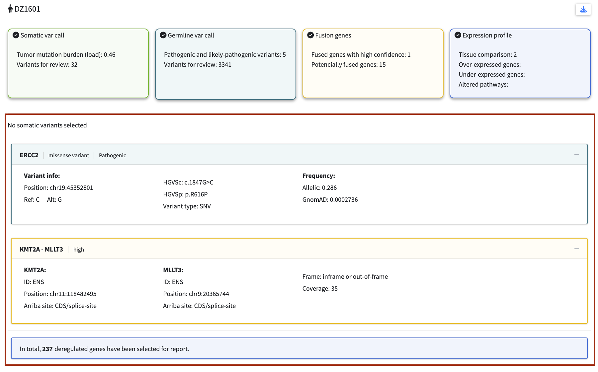
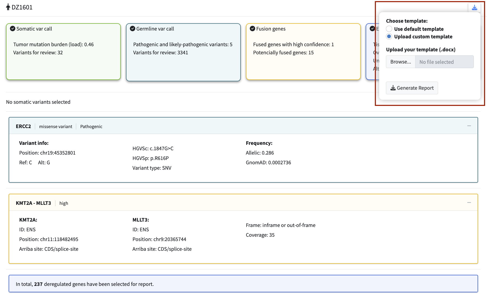

--- 
title: "SequiaViz Documentation"
author: "Kateřina Jurásková"
date: "`r Sys.Date()`"
site: bookdown::bookdown_site
documentclass: book
output:
  bookdown::bs4_book:
    bootswatch: dark
    css: "custom-styles.css"

---

# Introduction {-}

SequiaViz is an open-source platform for patient-centric integration and visualization of multi-omics data in clinical oncology diagnostics. It combines results from variant calling, fusion detection, and expression profiling with embedded genome browsing, dynamic pathway visualization, and automated clinical reporting—all within a secure, locally deployable framework.

## Key features {-}

- **Multi-Omics Integration**: Unified interface for variants, fusions, and expression data with multi-site comparisons
- **Interactive Variant Analysis**: Filterable tables, Variant Allele Frequency (VAF) and Sankey visualization
- **Fusion Gene Validation**: IGV snapshots with supporting evidence and confidence metrics
- **Embedded Genome Browsing**: Integrated IGV viewer for read-level validation without leaving the application
- **Dynamic Pathway Visualization**: Interactive networks using Cytoscape with STRING DB and KEGG pathway integration
- **Expression Analysis**: Tissue-matched reference data and volcano plots for deregulated genes
- **Clinical Reporting**: Automated draft generation from predefined or custom templates
- **Session Management**: Save and load analysis sessions for reproducible workflows
- **Secure Deployment**: Docker containerization for local, data-secure infrastructure
- **User-Friendly Interface**: Guided workflow, real-time tables, and downloadable results

## Live demo  {-}
We are hosting a live demo of SequiaViz to showcase its capabilities and allow users to explore the platform in action.
**Access the demo at: [Live Demo](http://your-demo-link.com)**

::: {.alert .alert-warning style="margin-top: 0.5rem;"}
**Important Notes:**

- Demo data is anonymized and does not represent real clinical cases
- Some features may have limited functionality due to data sensitivity requirements
- Session data is not persisted between visits
- While the demo runs the full version of SequiaViz, uploading your own data is not supported. We strongly discourage uploading sensitive or personal data to the demo environment. For production use with your own data, deploy SequiaViz locally using Docker.
- For production use with sensitive data, deploy SequiaViz locally using Docker
:::

# How to install and run {-}

SequiaViz is deployed using Docker containers for easy local deployment. The setup consists of two interconnected services managed through Docker Compose.

## Prerequisites {-}

SequiaViz currently supports **Linux only**. Before you can run SequiaViz locally, ensure you have the following installed:

### 1. Docker Installation {-}
- **Linux**: Install Docker using your package manager (e.g., `sudo apt-get install docker.io` on Ubuntu).

Verify installation by running:
```bash
docker --version
docker run hello-world
```

### 2. Docker Compose {-}
Docker Compose comes bundled with Docker Desktop. Verify it's installed:
```bash
docker-compose --version
```

### 3. System Requirements {-}
- **Disk Space**: At least 10 GB free space for Docker images and data
- **RAM**: Minimum 4 GB, recommended 8 GB or more
- **CPU**: Multi-core processor recommended
- **Internet Connection**: Required to pull Docker images and for STRING DB API access (needed for dynamic pathway visualization)

### 4. Input Files {-}
Prepare your data files in an `input_files` directory in your project folder. For details on required file formats and specifications, see the [Data Requirements](#data-requirements) chapter.

## Steps to Run {-}

1. **Clone or Download the Repository**:  
   Get the project files including the `docker-compose.yml`:
   ```bash
   git clone <repository-url>
   cd sequiaViz
   ```

2. **Prepare Your Data**:  
   Place your input files in the `input_files` directory:
   ```bash
   mkdir -p input_files
   # Copy your data files here
   ```

3. **Start the Application with Docker Compose**:  
   From the project directory, run:
   ```bash
   docker-compose up -d
   ```
   This command pulls the required images and starts both the SequiaViz application and IGV static server in the background.

4. **Access the Application**:  
   Open your web browser and navigate to:
   ```
   http://localhost:8080
   ```

5. **Verify Services Are Running**:  
   Check container status:
   ```bash
   docker-compose ps
   ```
   You should see two containers running: `sequiaviz-shiny` and `igv-static`.

## Troubleshooting {-}

**Container fails to start:**
```bash
docker-compose logs sequiaviz-shiny
docker-compose logs igv-static
```

**Input files not accessible:**
Ensure the `input_files` directory exists and contains your data files. Check file permissions.

**Slow performance:**
Increase Docker's allocated CPU and RAM in Docker Desktop settings (Preferences → Resources).

## Stopping and Cleaning Up {-}

Stop the application:
```bash
docker-compose down
```

Remove all containers and images:
```bash
docker-compose down -v
docker image prune -a
```

::: {.alert .alert-info style="margin-top: 0.5rem;"}
## Notes {-}
- The `input_files` directory is mounted as read-only for the IGV server and read-write for SequiaViz
- Both services communicate via the internal Docker network — no manual network configuration needed
- Session data is stored within the containers; use Docker volumes for persistence if needed
- All data remains on your local machine; nothing is sent to external servers
- **For organizational deployment**: If you're interested in using SequiaViz but don't have Docker expertise, contact your bioinformatics team or IT department. They can help set up and maintain SequiaViz in your organization's infrastructure.
:::


<!--chapter:end:index.Rmd-->


---
output:
  bookdown::bs4_book:
    bootswatch: dark
    css: "custom-styles.css"
---

# **Data requirements** {-}

## **Input file types and formats** {-}

SequiaViz integrates results from four types of genomic datasets:

### **1. Somatic Variant Calling** {-}
Exploration and visualization of somatic mutations in tumor-normal paired samples

- **Required files**: 
  - `.tsv` | `.vcf` file with annotated variants
  
- **Optional files** (needed for IGV visualization):     
  - Tumor DNA `.bam` + `.bai` files
  - Normal DNA `.bam` + `.bai` files
  - Tumor mutational burden (TMB) `.tsv` | `.xlsx` | `.txt` file

### **2. Germline Variant Calling** {-}
Exploration and visualization of germline mutations in normal samples

- **Required files**:
  - `.tsv` | `.vcf` file with annotated variants
  
- **Optional files** (needed for IGV visualization):  
    - Normal `.bam` + `.bai` files

### **3. Fusion Genes Detection** {-}
Exploration and visualization of gene fusions from RNA-seq tumor samples

- **Required files**:
  - `.tsv` | `.xlsx` files with detected genes fusion  (`.tsv` is not implemented yet)
  
- **Optional files** (needed for IGV visualization and row expansion preview):  
  - Tumor RNA `.bam` + `.bai` files
  - Chimeric `.bam` + `.bai` files
  - Arriba `.pdf` + `.tsv` files (for embedded report display and quality metrics)

### **4. Expression Profile** {-}
Exploration and visualization of gene expression in different tissues

- **Required files**:
  - `.tsv` | `.xlsx` | `.txt` file with expression data of sample OR files with tissue-matched reference expression data
  
- **Optional files**:  
  - Genes of interest (GOI) `.tsv` | `.xlsx` | `.txt` file

::: {.alert .alert-success}
**Tip:** If you can choose, **always** prioritize **`.tsv`** files over `.xlsx` or `vcf` files because they are faster to load and process.
:::

---

## Data organization and directory structure {-}

### Recommended Directory Structure {-}

```
project_root/
├── somatic_data/
│   ├── mutation_loads.tsv                    # tumor mutational burden table
│   ├── patient_001/
│   │   ├── variants.tsv                      # somatic variants table
│   │   ├── tumor.bam                         # tumor DNA BAM
│   │   ├── tumor.bam.bai                     # index for tumor DNA BAM
│   │   ├── normal.bam                        # normal DNA BAM
│   │   └── normal.bam.bai                    # index for normal DNA BAM
│   ├── patient_002/
│   │   └── ... (same structure)
│   └── patient_N/
│       └── ... (same structure)
├── germline_data/
│   ├── patient_001/
│   │   ├── variants.tsv                      # germline variants table
│   │   ├── normal.bam                        # normal DNA BAM
│   │   └── normal.bam.bai                    # index for normal DNA BAM
│   ├── patient_002/
│   │   └── ... (same structure)
│   └── patient_N/
│       └── ... (same structure)
├── fusion_data/
│   ├── patient_001/
│   │   ├── fusions.tsv                       # detected gene fusions table
│   │   ├── fusion.bam                        # tumor RNA BAM
│   │   ├── fusion.bam.bai                    # index for tumor RNA BAM
│   │   ├── chimeric.bam                      # chimeric BAM
│   │   ├── chimeric.bam.bai                  # index for chimeric BAM
│   │   ├── arriba_report.pdf                 # arriba report
│   │   └── arriba_results.tsv                # arriba result table
│   ├── patient_002/
│   │   └── ... (same structure)
│   └── patient_N/
│       └── ... (same structure)                  
└── expression_data/
    ├── genes_of_interest.tsv                 # table of genes of interest
    ├── patient_001/
    │   └── expression.tsv                    # gene expression table
    ├── patient_002/
    │   └── ... (same structure)
    └── patient_N/
        └── ... (same structure)   
```
... or in case of multiple tissue-matched reference expression data:

```
└── expression_data/
    ├── genes_of_interest.tsv                 # list of genes of interest
    ├── patient_001/
    │   ├── blood_expression.tsv              # expression in blood
    │   └── liver_expression.tsv              # expression in liver
    ├── patient_002/
    │   └── ... (same structure)
    └── patient_N/
        └── ... (same structure)   


```

### Alternative Directory Structures {-}


#### Option 1: BAM + BAI files in separate folders {-}

```
project_root/
├── primary_analysis/
│   ├── DNA_alignment/
│   │   ├── patient_001/       
│   │   │   └── mapped/
│   │   │       ├── tumor.bam                 # tumor DNA BAM
│   │   │       ├── tumor.bam.bai             # index for tumor DNA BAM
│   │   │       ├── normal.bam                # normal DNA BAM
│   │   │       └── normal.bam.bai            # index for normal DNA BAM
│   │   └── patient_N/
│   │       └── ... 
│   └── RNA_alignment/
│       ├── patient_001/       
│       │   └── mapped/
│       │       ├── fusion.bam                # tumor RNA BAM
│       │       ├── fusion.bam.bai            # index for tumor RNA BAM
│       │       ├── chimeric.bam              # chimeric BAM
│       │       └── chimeric.bam.bai          # index for chimeric BAM
│       └── patient_N/
│           └── ... 
└── secondary_analysis/
    ├── somatic_data/
    │   ├── mutation_loads.tsv                    # tumor mutational burden table
    │   ├── patient_001/
    │   │   └── variants.tsv                      # somatic variants table
    │   └── patient_N/
    │       └── ... 
    ├── germline_data/
    │   ├── patient_001/
    │   │   └── variants.tsv                      # germline variants table
    │   └── patient_N/
    │       └── ...
    ├── fusion_data/
    │   ├── patient_001/
    │   │   ├── fusions.tsv                       # detected gene fusions table
    │   │   ├── arriba_report.pdf                 # arriba report
    │   │   └── arriba_results.tsv                # arriba result table
    │   └── patient_N/
    │       └── ... 
    └── expression_data/
        ├── genes_of_interest.tsv                 # table of genes of interest
        ├── patient_001/
        │   └── expression.tsv                    # gene expression table
        └── patient_N/
           └── ...
```

#### Option 2: All files in patient directories {-}
```
project_root/
├── genes_of_interest.tsv                     # table of genes of interest
├── mutation_loads.tsv                        # tumor mutational burden table
├── patient_001/
│   ├── somatic_variants.tsv                  # somatic variants table
│   ├── germline_variants.tsv                 # germline variants table
│   ├── fusions.tsv                           # detected gene fusions table
│   ├── tumor.bam                             # tumor DNA BAM
│   ├── tumor.bam.bai                         # index for tumor DNA BAM
│   ├── normal.bam                            # normal DNA BAM
│   ├── normal.bam.bai                        # index for normal DNA BAM
│   ├── fusion.bam                            # tumor RNA BAM
│   ├── fusion.bam.bai                        # index for tumor RNA BAM
│   ├── chimeric.bam                          # chimeric BAM
│   ├── chimeric.bam.bai                      # index for chimeric BAM
│   ├── arriba_report.pdf                     # arriba report
│   ├── arriba_results.tsv                    # arriba result table
│   └── expression.tsv                        # gene expression table
├── patient_002/
│   └── ... 
└── patient_N/
    └── ... 
```


### File Naming {-}

#### General Rules {-}
- Use consistent naming across all patients
- Avoid special characters and spaces
- Use underscores or dots as separators
- All file names must be unique within their directory
- All per-patient files must have **patient ID** and **dataset type** (somatic, germline, fusion, expression|RNAseq) somewhere **in their path name**


**Examples:**

| Variant A                                | Variant B                                 |
|------------------------------------------|-------------------------------------------|
| <code style = "color: #000000;">project_root/patient_001/<span style="font-weight:bold; color: #D63384;">somatic</span>_variants.tsv</code> | <code style = "color: #000000;">project_root/<span style="font-weight:bold; color: #D63384;">somatic</span>_data/patient_001_variants.tsv</code> |
| <code style = "color: #000000;">project_root/patient_001/<span style="font-weight:bold; color: #D63384;">expression</span>.tsv</code> | <code style = "color: #000000;">project_root/<span style="font-weight:bold; color: #D63384;">RNAseq</span>/patient_001.tsv</code> |

<br>

::: {.alert .alert-info}
**Note:** GOI and TMB files are not considered per-patient files because they contain information about all samples
:::

#### Specific Patterns {-}
- **Variants**:
    - No specific patterns for this file
- **Fusions**:
    - File cannot contain the strings **arriba** or **STAR** in their filename. These strings are exclusively reserved for Arriba and STARFusion files
- **Arriba files**:
    - For each `.pdf` arriba report there must be a corresponding `.tsv` arriba results table
    - File name must contain string **arriba**
    - Files cannot contain the strings **discarded** or **STAR** in their filename. These strings are exclusively reserved for arriba_discarded.tsv and STARfusion files
- **Expression**:
    - In case of multiple tissue-matched reference expression data, files must contain `{tissue_name}` otherwise the name must contain `{patient_id}`
    - Files cannot contain the strings **report** or **genes_of_interest** in their filename. These strings are exclusively reserved for Arriba and GOI files
- **BAM + BAI**:
    - For each `file.bam` there must be corresponding `file.bam.bai` or `file.bai`
    - BAM and BAI files must be named the same pattern in the same directory
    - Tumor RNA BAM files cannot contain the strings **chimeric** or **transcriptome** in their filename. These strings are exclusively reserved for chimeric BAM files
- **GOI**:
    - File must be named as `genes_of_interest`
    - File must be placed in the **root directory** of expression data
    - File is common to all samples
- **TMB**: 
    - File must be named as `TMB` or `mutation_loads`
    - File must be placed in the **root directory** of somatic data
    - File is common to all samples

Examples of placement `genes_of_interest` and `TMB` files in different directory structures:
```
project_root/                                 # root directory for both somatic and expression data
├── genes_of_interest.tsv                     # table of genes of interest
├── mutation_loads.tsv                        # tumor mutational burden table
├── patient_001/
│   ├── somatic_variants.tsv 
│   └── expression.tsv 
└── patient_N/
        └── ...
```
<br>
or 
```
project_root/                       
├── somatic_data/                             # root directory for somatic data
│   ├── mutation_loads.tsv                    # tumor mutational burden table
│   ├── patient_001/
│   │   └── variants.tsv                      
│   └── patient_N/
│       └── ...            
└── expression_data/                          # root directory for expression data
    ├── genes_of_interest.tsv                 # table of genes of interest
    ├── patient_001/
    │   └── expression.tsv
    └── patient_N/
        └── ... 
```
--- 

## Required and Optional Columns {-}

### Somatic variants {-}
- **Required columns:**

| Column | Type | Description |
|--------|------|-------------|
| `var_name` | char | Variant identifier |
| `gene_symbol` | char | Gene symbol |
| `tumor_variant_freq` | num | Tumor variant frequency |
| `tumor_depth` | int | Tumor sequencing depth |
| `gene_region` | char | Gene region (exon, intron, etc.) |
| `gnomAD_NFE` | num | gnomAD Non-Finnish European allele frequency |
| `consequence` | char | Variant consequence (missense, nonsense, etc.) |
| `HGVSc` | char | HGVS coding sequence notation |
| `HGVSp` | char | HGVS protein sequence notation |
| `variant_type` | char | Type of variant (SNV, insertion, deletion, etc.) |
| `all_full_annot_name` | char | Full annotation name |

- **Optional columns:**

| Column | Type | Description |
|--------|------|-------------|
| `in_library` | num | Number of times the `var_name` is observed in the sample cohort (added automatically) |
| `clinvar_sig` | char | ClinVar clinical significance |
| `clinvar_DBN` | char | ClinVar disease name |
| `CGC_Somatic` | char | Cancer Gene Census somatic annotation |
| `fOne` | char | fOne database annotation |
| `COSMIC` | char | COSMIC database annotation |
| `HGMD` | char | HGMD database annotation |
| `snpDB` | char | dbSNP annotation |


#### TMB {-}
- **Required columns:**

| Column | Type | Description |
|--------|------|-------------|
| `patient` | char | Patient ID |
| `TMB` | num | Tumor mutational burden value |

<br>

Example of `mutation_loads.tsv`

::: {.example-table}
| patient | TMB  |
|---------|------|
| P001    | 0.17 |
| P002    | 0.74 |
:::


### Germline variants {-}

- **Required columns:* {-}**

| Column | Type | Description |
|--------|------|-------------|
| `var_name` | char | Variant identifier |
| `gene_symbol` | char | Gene symbol |
| `variant_freq` | num | Variant frequency |
| `coverage_depth` | int | Sequencing coverage depth |
| `gene_region` | char | Gene region (exon, intron, etc.) |
| `gnomAD_NFE` | num | gnomAD Non-Finnish European allele frequency |
| `clinvar_sig` | char | ClinVar clinical significance |
| `consequence` | char | Variant consequence (missense, nonsense, etc.) |
| `HGVSc` | char | HGVS coding sequence notation |
| `HGVSp` | char | HGVS protein sequence notation |
| `variant_type` | char | Type of variant (SNV, insertion, deletion, etc.) |
| `all_full_annot_name` | char | Full annotation name |

- **Optional columns:**

| Column | Type | Description |
|--------|------|-------------|
| `in_library` | num | Number of times the `var_name` is observed in the sample cohort (added automatically if not present) |
| `clinvar_DBN` | char | ClinVar disease name |
| `CGC_Germline` | char | Cancer Gene Census germline annotation |
| `trusight_genes` | char | TruSight gene panel annotation |
| `fOne` | char | fOne database annotation |
| `snpDB` | char | dbSNP annotation |


### Fusion Genes {-}

::: {.alert .alert-info}
**Note:** 
- Data must contain results from **Arriba** and **StarFusion** callers
- Both `chr1`/`chr2` and `chrom1`/`chrom2` column names are accepted
- If `chrom1`/`chrom2` are present, they will be automatically renamed to `chr1`/`chr2` during data loading
:::

- **Required columns:**

| Column | Type | Description |
|--------|------|-------------|
| `gene1` | char | Gene name of first fusion partner |
| `gene2` | char | Gene name of second fusion partner |
| `chr1` or `chrom1` | char | Chromosome of first fusion partner (with "chr" prefix) |
| `chr2` or `chrom2` | char | Chromosome of second fusion partner (with "chr" prefix) |
| `pos1` | num | Genomic position of first fusion partner |
| `pos2` | num | Genomic position of second fusion partner |
| `strand1` | char | Strand orientation of first fusion partner (+/-) |
| `strand2` | char | Strand orientation of second fusion partner (+/-) |
| `arriba.called` | boolean | Whether Arriba called the fusion (true/false) |
| `starfus.called` | boolean | Whether STARFusion called the fusion (true/false) |
| `overall_support` | num | Overall support for the fusion |
| `arriba.confidence` | char | Confidence score from Arriba (high/medium/low) |
| `arriba.site1` | char | Breakpoint site annotation for first fusion partner |
| `arriba.site2` | char | Breakpoint site annotation for second fusion partner |


- **Optional columns:**

| Column | Type | Description |
|--------|------|-------------|
| `DB_count` | int | Number of databases where the fusion is found |
| `DB_list` | char | List of databases containing the fusion |
| `arriba.split_reads` | int | Number of split reads supporting the fusion (Arriba) |
| `arriba.discordant_mates` | int | Number of discordant mate pairs supporting the fusion (Arriba) |
| `arriba.break_coverage` | int | Coverage at first breakpoint (Arriba) |
| `arriba.break2_coverage` | int | Coverage at second breakpoint (Arriba) |
| `arriba.break_seq` | char | Sequence at breakpoint (Arriba) |
| `starfus.split_reads` | int | Number of split reads supporting the fusion (STARFusion) |
| `starfus.discordant_mates` | int | Number of discordant mate pairs supporting the fusion (STARFusion) |
| `starfus.counter_fusion1` | int | Counter fusion reads for first gene (STARFusion) |
| `starfus.counter_fusion2` | int | Counter fusion reads for second gene (STARFusion) |
| `starfus.splice_type` | char | Type of splice junction (STARFusion) |
| `starfus.break_seq` | char | Sequence at breakpoint (STARFusion) |


### Expression Data {-}

- **Required columns:**

| Column | Type | Description |
|--------|------|-------------|
| `sample` | char | Sample ID |
| `feature_name` | char | Gene name |
| `geneid` | char | Gene ID (Ensembl, RefSeq, or other) |
| `all_kegg_gene_names` | char | KEGG gene names |
| `log2FC` | num | Log2 fold change |
| `p_value` | num | P-value |
| `p_adj` | num | Adjusted p-value |

- **Optional columns:**

| Column | Type | Description |
|--------|------|-------------|
| `pathway` | char | Pathway name (if available, otherwise automatically retrieved from KEGG) |
| `refseq_id` | char | RefSeq gene ID |
| `type` | char | Gene type |
| `gene_definition` | char | Gene definition/description |
| `num_of_paths` | int | Number of pathways |

#### GOI {-}

- **Required columns:**

| Column | Type | Description |
|--------|------|-------------|
| `gene` | char | Gene name |

- **Optional columns:**

| Column | Type | Description |
|--------|------|-------------|
| `pathway` | char | Pathway name |

::: {.alert .alert-info}
**Note:** If column `pathway` is not available, app will automatically use pathways from KEGG DB
:::

Example of `genes_of_interest.tsv`

::: {.example-table}
| gene  | pathway            |
|-------|--------------------|
| BRCA1 | DNA damage/repair  |
| TP53  | RTK Signaling      |
:::


<!--chapter:end:01-data-requirements.Rmd-->

---
output:
  bookdown::bs4_book:
    bootswatch: dark
    css: "custom-styles.css"
---

# Upload data {-}

This module serves as the starting point for the SequiaViz application. Before uploading data, ensure that your input files and directories are properly formatted according to the specifications outlined in chapter [Data Requirements](#data-requirements) and section below.

## Step 1: Directory, patient and dataset selection {-}
1. **Select main directory** containing data for all patients. 

   In example bellow, the **main directory** is `project_root`, which contains subdirectories for each patient (`patient_001`, ..., `patient_N`) and general files like `genes_of_interest.tsv` and `mutation_loads.tsv`.

   If you select a broader directory, such as `user`, it may contain unnecessary files that could interfere with the tool’s ability to select correct files. To avoid this, it is recommended to select the most specific directory possible, such as `project_root`.

```
home/
└── user/
    └── project_root/
        ├── genes_of_interest.tsv                     # table of genes of interest
        ├── mutation_loads.tsv                        # tumor mutational burden table
        ├── patient_001/
        │   ├── somatic_variants.tsv                  # somatic variants table
        │   ├── germline_variants.tsv                 # germline variants table
        │   ├── fusions.tsv                           # detected gene fusions table
        │   ├── tumor.bam                             # tumor DNA BAM
        │   ├── tumor.bam.bai                         # index for tumor DNA BAM
        │   ├── normal.bam                            # normal DNA BAM
        │   ├── normal.bam.bai                        # index for normal DNA BAM
        │   ├── fusion.bam                            # tumor RNA BAM
        │   ├── fusion.bam.bai                        # index for tumor RNA BAM
        │   ├── chimeric.bam                          # chimeric BAM
        │   ├── chimeric.bam.bai                      # index for chimeric BAM
        │   ├── arriba_report.pdf                     # arriba report
        │   ├── arriba_results.tsv                    # arriba result table
        │   └── expression.tsv                        # gene expression table
        └── patient_N/
            └── ... 
```    
2. **Add patient IDs** 

   Enter one or more patient IDs. If you have multiple IDs, you can input them all at once, separated by commas or new lines.

3. **Select dataset types** you want to visualize. 

   For each dataset, you can define specific patterns to identify relevant files:
   - **Set patterns** for BAM files (e.g., "tumor", "FFPE", "normal", "ctrl", "chimeric"). If no pattern is set, BAM and BAI files will not be searched for.
   - **Set reference tissues** for expression analysis (e.g., "blood", "blood_vessel", "liver"). If no tissue is specified, the tool will search for a file named `expression.tsv`.

   If a dataset is not selected, its files will be ignored.
   
::: {.alert .alert-info}
**Note:** In case of more words in tissue names (e.g., "blood vessel"), use underscores instead of spaces (e.g., "blood_vessel"). Also, in Validation step, make extra sure, that correct file was paired to correct tissue.
:::

## Step 2: Validation and confirmation {-}
1. The application **searches** the selected directory and identifies all relevant files.
2. It **displays an overview** of the files found for each patient and selected dataset.
3. It **marks problems** using colored icons:
   - 🟢 **Green**: All required files are found (e.g., variant file, fusion file, expression file).
   - 🟠 **Orange**: Optional files are missing (e.g., BAM files for IGV visualization). You can continue without these files, but some features will be unavailable.
   - 🔴 **Red**: Required files are missing or there are too many files. You must resolve these issues before proceeding. See the Common Errors and Solutions section below for help.
4. **Confirm configuration** to continue

::: {.alert .alert-info}
**Note:** If you realize in Step 2 that you made a mistake in Step 1, you can go back to Step 1 using the **Back** to Selection button and adjust your configuration. If you didn’t make a mistake but notice that some files are missing, you can add them to the directory or rename them as needed. Then, use the **Refresh** button to search for files again.
:::

::: {.alert .alert-success}
**Tip:** If you have previously worked on a configuration and saved the session, you can upload it directly using the **Load Session** button. This will allow the application to skip the Selection and Validation steps and load the configuration from the saved file.
:::

::: {.alert .alert-warning}
**Caution:** If present, the `genes_of_interest.tsv` and `mutation_loads.tsv` files will appear as detected files for each patient, even though only one file is shared among all patients.
:::

## Common Errors and Solutions {-}

#### **"Required file missing"** {-}
**Cause**: A required file for the selected dataset type is missing.  
**Solution**:

- Verify that the file exists in the patient directory.
- Check the file name to ensure it includes the patient ID (pay special attention to case sensitivity).
- Confirm that the file has the correct extension (e.g., `.tsv`, `.xlsx`).

#### **"Multiple files found"** {-}
**Cause**: Multiple files of the same type were found for a single patient.  
**Solution**:

- Remove or rename duplicate files.
- Ensure that each patient has only one file of each type.
- Review BAM file patterns to ensure they are not too general.

#### **"Missing BAM or BAI"** {-}
**Cause**: A BAM file is missing its corresponding index file (.bai).  
**Solution**:

- Generate the missing `.bai` file using the command `samtools index`.
- Ensure that the `.bai` file is named correctly.
- For example, if the BAM file is `file.bam`, the index file must be `file.bam.bai` or `file.bai`.

#### **"Missing PDF or TSV"** {-}
**Cause**: The output from the Arriba analysis is incomplete.  
**Solution**:

- Ensure that both the `.pdf` and `.tsv` files from the Arriba analysis are present.
- Verify that both files include the string "arriba" in their names and have the correct extensions (`.tsv`, `.pdf`).


**FILL ALSO USE CASE FOR EXPRESSION FILES - MORE TISSUES THAN FILES OR MORE FILES THEN TISSUES --> TROUBLES WITH MATCHING TISSUE NAMES** {-}

#### **"        "** {-}
**Cause**: The number of tissues does not match the number of expression files found, or the tissue names cannot be matched to the files.  
**Solution**:

- Verify that each tissue has a corresponding expression file.
- Ensure that tissue names in the configuration match the file names (use underscores instead of spaces, e.g., `blood_vessel` instead of `blood vessel`).
- Double-check the pairing of tissues and files during the validation step.


<!--chapter:end:02-upload-data.Rmd-->

---
output:
  bookdown::bs4_book:
    bootswatch: dark
    css: "custom-styles.css"
---

# Core Module Features {-}

The following features are common across multiple analysis modules: **Variant Calling**, **Fusion Genes**, and **Expression Profile**. These shared functionalities provide a consistent and intuitive user experience throughout the application.

## Interactive Data Tables {-}

All data in the analysis modules are displayed using the `reactable` package, providing fully interactive tables with real-time responsiveness.

- **Sorting:** Click any column header to sort data in ascending or descending order
- **Built-in filtering:** Use the search boxes within each column to filter data on-the-fly
- **Resizable columns:** Adjust column widths by dragging the column borders
- **Multi-column operations:** Combine filters and sorts across multiple columns simultaneously

::: {.alert .alert-success}
**Tip:** Hold the `Shift` key while clicking column headers to sort by multiple columns simultaneously.
To clear sorting, hold `Shift` and click again — the order cycles through **ascending → descending → unsorted**.
:::

## Filtering Menu {-}

While the interactive table provides basic filtering capabilities, the dedicated filtering menu offers more sophisticated filtering options for parameters that require specific logic:

- **Custom Column Selection:** Show or hide columns to focus on relevant data
- **Module-Specific Filters:** Each module provides specialized filtering options tailored to its data type

```{r, echo=FALSE, out.width="100%"}

```

::: {.alert .alert-success} 
**Performance Tip:**
Apply filters **before** reviewing or marking items. Working with a filtered subset significantly **reduces** data reload times and keeps the application responsive.
:::

## Review and Selection {-}

All analysis modules allow you to curate variants, fusions, or genes through an intuitive selection:

- **Mark Items:** Select variants, fusions, or genes directly from the interactive table
- **Clinical Significance:** Assign relevant clinical classifications based on the module type
- **Review Panel:** Selected variants, fusions, or genes appear in a dedicated table for easy review
- **Edit Selection:** Remove variants, fusions, or genes from your selection if needed

```{r, echo=FALSE, out.width="100%"}

```

::: {.alert .alert-warning}
**Note:** Only selected variants, fusions, or genes will be included in the final report. For modules with IGV integration, only selected variants, fusions, or genes can be inspected in IGV.
:::

## Integrated Genome Viewer (IGV) {-}

Validate findings at the read level with seamless IGV integration.

- **Multi-Patient Analysis:** Select multiple patients simultaneously for comparative viewing
- **Direct Launch:** Open IGV directly from the module with pre-loaded data
- **Read-Level Validation:** Inspect sequencing reads, coverage, and alignment quality
- **Context Visualization:** View findings in their genomic context with annotations

```{r, echo=FALSE, out.width="100%"}

```
 
::: {.alert .alert-danger}
The IGV functionality relies on the availability of **BAM/BAI files**. Ensure these files are loaded during data import to enable IGV data exploration.
:::

## Data Export {-}

Export your data in multiple formats for downstream analysis or reporting:

- **Supported Formats:** TSV, XLSX, CSV
- **Export Options:**
  - Export the currently **filtered table** (only visible items)
  - Export the **complete dataset** (all items)
  - Export visualizations as images

```{r, echo=FALSE, out.width="100%"}

```

<!--chapter:end:03-common-features.Rmd-->

---
output:
  bookdown::bs4_book:
    bootswatch: dark
    css: "custom-styles.css"
---

# Summary and Report {-}

The **Summary and Report** module provides a comprehensive overview of user-selected oncogenic and pathogenic variants, true-positive fusions, and deregulated genes across all modules. This module is designed to streamline the process of generating clinical reports by integrating findings from the entire analysis workflow.

## Overview of Features {-}

Each dataset type is color-coded for easy identification:

- Somatic variants: <code style="color: #7ac143; background-color: #f8fcf6ff; border: 1.5px solid #7ac143; padding: 2px 6px; border-radius: 3px; font-weight: bold;">Light green</code>
- Germline variants: <code style="color: #45818e; background-color: #f1f8f9ff; border: 1.5px solid #45818e; padding: 2px 6px; border-radius: 3px; font-weight: bold;">Dark green</code>
- Fusion genes: <code style="color: #f1c232; background-color: #fffdf7ff; border: 1.5px solid #f1c232; padding: 2px 6px; border-radius: 3px; font-weight: bold;">Yellow</code>
- RNA expression profiles: <code style="color: #3c78d8ff; background-color: #f2f6fcff; border: 1.5px solid #3c78d8ff; padding: 2px 6px; border-radius: 3px; font-weight: bold;">Blue</code>

### Info Boxes {-}

Each dataset has an info box summarizing key metrics and findings from the analysis, providing a quick overview of the results. If a value is not available, it will be displayed as "N/A".

```{r, echo=FALSE, out.width="100%"}

```

<br>

| **Module**                | **Feature**                                                                                       | **Details**                                                                                     |
|---------------------------|---------------------------------------------------------------------------------------------------|-------------------------------------------------------------------------------------------------|
| Somatic Variant Calling | Tumor mutational burden (TMB)                                                                   | Value taken from `mutation_loads.tsv` file, if available.                                       |
|                           | Variants for review                                                                              | Number of somatic variants after applying filters: <br> • `gnomAD_NFE <= 0.01` <br> • `coverage_depth > 10` <br> • `Consequence != "synonymous_variant"` <br> • `gene_region == "exon" or "splice"` |
| Germline Variant Calling | Variants for review                                                                           | Number of germline variants after applying filters: <br> • `gnomAD_NFE <= 0.01` <br> • `coverage_depth > 10` <br> • `Consequence != "synonymous_variant"` <br> • `gene_region == "exon" or "splice"` |
|                           | Pathogenic and likely-pathogenic variants                                                       | Number of germline variants classified by `CLINVAR` as `Pathogenic`, `Likely_pathogenic`, `Pathogenic/Likely_pathogenic`, `Pathogenic_(VUS)`,`Likely_pathogenic (VUS)`,`Pathogenic_(VUS)`    |
| Fusion Genes Detection | Fused genes with high confidence                                                                | Number of fusion genes classified by Arriba as `high` confidence.                              |
|                           | Potentially fused genes                                                                          | Number of fusion genes present in the table.                                                   |
| RNA Expression Profile | Tissue comparison                                                                              | Number of tissues used as reference.                                                           |
|                           | Deregulated genes for review                                                                     | Number of deregulated genes after applying filters: <br> • `log2FC > 1` <br> • `log2FC < -1` <br> • `p-value < 0.05` <br> • `coverage > 30 TPM` <br> **(Currently not implemented)** |
|                           | Altered pathways                                                                                | Number of altered pathways with `p-value < 0.05`. **(Currently not implemented)**                  |

### Selected findings {-}

This section displays a consolidated view of all flagged variants, fusions, and deregulated genes selected in previous modules. It provides an easy way to review findings before generating the final report.

```{r, echo=FALSE, out.width="100%"}

```

<br>

Expandable boxes contain the following details:

#### Somatic and Germline Variant Calling {-}
- **Box content**: Gene name, variant type, and ClinVar classification (if available).
- **Variant info**: Location, Ref, Alt, HGVSc, HGVSp, Variant type.
- **Frequency**: Allelic frequency, GnomAD frequency.

#### Fusion Genes Detection {-}
- **Box content**: Gene 1, Gene 2, and Arriba confidence level.
- **Fusion info**: Gene 1, Gene 2, Position 1, Position 2, Strand 1, Strand 2.
- **Frequency**: Overall support, Arriba site.

#### RNA Expression Profile {-}
- This section is not expandable. It contains a summary of all flagged genes, including genes of interest and all deregulated genes.


### Report Generation {-}
Reports can be generated using either a predefined template or a user-uploaded custom template to ensure the report format aligns with institutional or regulatory requirements.

```{r, echo=FALSE, out.width="100%"}

```
<br>

::: {.alert .alert-danger}
### Limitations {-}

- The automatically generated report should be regarded as a **draft** rather than a final clinical document.
- Due to limited access to some metadata and the challenge of retrieving context-specific textual annotations for variants, the report requires **manual review** and completion by a clinician.
- The module ensures that all findings are presented in a structured format suitable for clinical interpretation.
:::

## Creating Custom Templates {-}

The module supports keyword-based variable substitution to populate the report with patient-specific findings.

### Available Keywords {-}

| **Keyword**               | **Description**                                                                                     |
|---------------------------|-----------------------------------------------------------------------------------------------------|
| `<<patient_info>>`        | Contains patient-specific information such as patient ID, diagnosis, and report generation date.    |
| `<<summary_somatic>>`     | List of oncogenic somatic variants flagged during the review process.                  |
| `<<summary_germline>>`    | Lists of pathogenic germline variants flagged during the review process.         |
| `<<summary_fusion>>`      | Lists of true-positive gene fusions flagged during the review process.                                 |
| `<<somatic_table>>`       | A detailed table of somatic variants informations, including gene, transcript, variant, VAF, consequence, and classification. |
| `<<germline_table>>`      | A detailed table of germline variants informations, including gene, transcript, variant, MAF, consequence, phenotype, zygosity, inheritance, and classification. |
| `<<fusion_table>>`        | A detailed table of gene fusions informations, including gene pair, transcripts, overall support, and phasing.   |
| `<<expression_table>>`    | A detailed table of deregulated genes informations, including gene, transcript, expression level, log2FC, and therapeutic options. |
| `<<mutation_burden>>`     | Displays the tumor mutation burden (TMB) value of the patient.                                     |
| `<<somatic_interpretation>>` | Provides textual interpretation of somatic variants list, including links to external resources.       |
| `<<germline_interpretation>>` | Provides textual interpretation of germline variants list, including links to external resources.     |

### How to Use Keywords {-}

1. **Insert Keywords**: Place the keywords in your `.docx` template where you want the corresponding data to appear.
   - Example:
     ```
     Patient Information:
     <<patient_info>>

     Summary of Somatic Variants:
     <<summary_somatic>>

     Detailed Somatic Variant Table:
     <<somatic_table>>
     ```

2. **Formatting**: Ensure that the placeholders are surrounded by double angle brackets 
(`<< >>`) and match the exact keyword names.

3. **Save as `.docx`**: Save your template as a `.docx` file and upload it using the **Upload custom template** option in the application.

::: {.alert .alert-info}
### Notes {-}

- The placeholder `<<patient_info>>` is essential for generating a meaningful report. Ensure it is included in your template.
- If certain data (e.g., `<<fusion_table>>`) is not available for a patient, the placeholder will be replaced with a default message.
- Test your template with sample data to ensure all placeholders are replaced correctly.
- Use your institution's branding and formatting guidelines to style the template.
:::

This guidance ensures that users can create custom templates tailored to their specific needs while maintaining compatibility with the application's reporting system.


<!--chapter:end:04-summary-report.Rmd-->

---
output:
  bookdown::bs4_book:
    bootswatch: dark
    css: "custom-styles.css"
---

# Variant Calling {-}

The **Variant Calling** module is divided into two submodules - **Somatic** Variant Calling and **Germline** Variant Calling. Both submodules provide tools for reviewing, filtering, and selecting variants for further exploring and reporting through interactive tables, advanced filtering options, and integrated visualizations to streamline the review process.

For information about core features shared across analysis modules (interactive tables, filtering, data selection, IGV integration, and data export), please refer to the **Core Module Features** chapter.

## Overview of Features {-}

### Variant-Specific Filtering {-}

In addition to the core filtering capabilities, the Variant Calling module provides specialized filtering options:

- **Gene Region:** Filter specifically for exon and splice regions
- **Consequence:** Select from multiple consequence types
- **Coverage Depth:** Set minimum coverage thresholds
- **Population Frequency:** Filter by gnomAD allele frequencies
- **ClinVar Significance:** (Germline only) Filter variants by clinical significance

```{r, echo=FALSE, out.width="100%"}

```

::: {.alert .alert-warning} 
**Default Filters Applied:** When you first view the data, the following filters are automatically applied to ensure optimal performance and focus on relevant variants.

• `gnomAD_NFE ≤ 0.01` (rare variants only)

• `coverage_depth > 10` (sufficient read support)

• `Consequence ≠ "synonymous_variant"` (exclude silent mutations)

• `gene_region == "exon" OR "splice"` (coding regions only)
:::

## Submodule-Specific Features {-}

### Somatic Variant Calling {-}

The somatic submodule is designed for analyzing tumor-specific variants with specialized metrics and visualizations:

**Key Features:**

- **Cancer Databases:** Filter by `COSMIC` and `CGC_Somatic` annotations

#### Tumor Variant Frequency Histogram {-}

This histogram displays the distribution of tumor variant allele frequencies (VAF) across all somatic variants. Selected variants are marked as blue lines.

```{r, echo=FALSE, out.width="100%"}
# knitr::include_graphics("./screenshots/variant-calling-VAF.png")
```

#### Sankey Diagram {-}

The Sankey diagram visualizes the relationships between somatic variants, their associated 
genes, and the biological pathways in which these genes participate. This integrative 
view highlights how molecular alterations connect to functional contexts, offering insights
into pathway-level disruptions.

```{r, echo=FALSE, out.width="100%"}
# knitr::include_graphics("./screenshots/variant-calling-sankey.png")
```

### Germline Variant Calling {-}

The germline submodule focuses on hereditary variants with clinical interpretation tools:

**Key Features:**

- **Clinical Annotations:** `ClinVar significance` 
- **Hereditary Cancer Database** Filter by `CGC_Germline` and `TruSight` Genes panels

## Table Columns {-}

The following table describes the columns available in the interactive tables for both submodules:

| **Column**               | **Description**                                                                                     | **Somatic** | **Germline** |
|--------------------------|-----------------------------------------------------------------------------------------------------|-------------|--------------|
| `Gene_symbol`            | The gene associated with the variant.                                                              | ✓           | ✓            |
| `var_name`               | The name of the variant.                                                                           | ✓           | ✓            |
| `HGVSc`                  | HGVS coding sequence annotation.                                                                  | ✓           | ✓            |
| `HGVSp`                  | HGVS protein sequence annotation.                                                                 | ✓           | ✓            |
| `variant_type`           | The type of variant (e.g., SNP, insertion, deletion).                                              | ✓           | ✓            |
| `tumor_variant_freq`     | The variant allele frequency in the tumor sample.                                                  | ✓           |              |
| `tumor_depth`            | The sequencing depth at the variant position in the tumor sample.                                  | ✓           |              |
| `variant_freq`           | The variant allele frequency in the germline sample.                                               |             | ✓            |
| `coverage_depth`         | The sequencing depth at the variant position in the germline sample.                               |             | ✓            |
| `gnomAD_NFE`             | The population frequency of the variant in the gnomAD Non-Finnish European population.             | ✓           | ✓            |
| `Consequence`            | The predicted functional consequence of the variant (e.g., missense, synonymous).                  | ✓           | ✓            |
| `clinvar_sig`            | The clinical significance of the variant according to ClinVar (e.g., pathogenic, likely pathogenic).|             | ✓            |
| `COSMIC`                 | Indicates whether the variant is listed in the COSMIC database.                                    | ✓           |              |
| `CGC_Somatic`            | Indicates whether the variant is associated with cancer in the CGC database.                      | ✓           |              |
| `CGC_Germline`           | Indicates whether the variant is associated with hereditary cancer in the CGC database.           |             | ✓            |
| `TruSight Genes`         | Indicates whether the variant is included in the TruSight Cancer Panel.                           |             | ✓            |

::: {.alert .alert-warning}
**Note:** The application recognizes additional columns beyond the required ones.
If your dataset includes extra columns, they will still appear in the table and can be used for filtering or display.
However, these columns will not have customized labels — only minor formatting is applied (dots and underscores are replaced with spaces).
:::

::: {.alert .alert-danger}
## Limitations {-}
- The IGV integration requires BAM/BAI files to be available for the selected patient.
:::


<!--chapter:end:05-variant-calling.Rmd-->

---
output:
  bookdown::bs4_book:
    bootswatch: dark
    css: "custom-styles.css"
---

# Fusion Genes {-}

The **Fusion Genes** module enables users to review, validate, and select causal gene fusions for inclusion in clinical reports. This module integrates supporting evidence, visualization tools, and filtering options to streamline the review process.

For information about core features shared across analysis modules (interactive tables, filtering, data selection, IGV integration, and data export), please refer to the **Core Module Features** chapter.

## Overview of Features {-}

### Fusion-Specific Table Features {-}

The interactive fusion table includes specialized features tailored for fusion analysis:

- **Expandable Rows**: Expand rows to view detailed annotations and supporting evidence, including the Arriba report and IGV snapshot in split-view mode.
- **Visual Check Column**: Use the ✔️ and ✖️ buttons to mark fusions as true-positive or false-positive. This helps track which fusions have been manually reviewed.
- **Notes Column**: Add custom notes for each fusion, such as reasons for marking it as false-positive, observations about low coverage, or other case-specific details.

```{r, echo=FALSE, out.width="100%"}
# knitr::include_graphics("./screenshots/fusion-table.png")
```

::: {.alert .alert-success}
**Tip:** Use the **expandable rows** to quickly review Arriba annotations and IGV snapshots. This helps **identify obvious false positives**, such as cases where no signal is visible at one of the gene positions.
:::

#### **Expanded Rows** {-}

The expanded row functionality provides a detailed view of each fusion, helping users quickly assess its validity:

- **Arriba Report**: Displays the full Arriba report for the selected fusion. The report includes:
  - Fusion partners and their respective orientation.
  - Exons retained within the fusion transcript.
  - Number of supporting read counts.
  - A snippet of the sequence surrounding the breakpoint.
- **IGV Snapshot**: Shows a split-view layout of the fusion breakpoint, with both gene positions displayed side by side. This visualization helps users quickly identify false positives, such as cases where no signal is visible at one of the gene positions. 

```{r, echo=FALSE, out.width="100%"}
# knitr::include_graphics("./screenshots/fusion-expanded.png")
```

::: {.alert .alert-danger}
The **expanded row** functionality relies on the availability of **Arriba TSV** and **PNG files** for the report, as well as **BAM/BAI files** and **chimeric BAM/BAI files** for IGV snapshots. Ensure these files are loaded during data import to enable these features.
:::

### Fusion-Specific Filtering {-}

In addition to core filtering capabilities, the Fusion Genes module provides specialized filtering:

- **Tissues:** Hide or show specific tissue comparisons
- **Pathways:** Filter data by pathway classifications

```{r, echo=FALSE, out.width="100%"}
# knitr::include_graphics("./screenshots/fusion-filter.png")
```

### Fusion-Specific IGV Integration {-}

The IGV integration in this module is optimized for fusion breakpoint validation:

- **Breakpoint Visualization**: Inspect fusion breakpoints in tumor BAM files.
- **Chimeric Reads**: View chimeric BAM files (if available) alongside tumor BAM files for additional evidence.
- **Split-View Layout**: Display both fusion breakpoints side by side for simultaneous comparison.

For more details on working with chimeric reads in IGV, refer to the [Arriba Visualization Guide](https://github.com/suhrig/arriba/wiki/06-Visualization).

```{r, echo=FALSE, out.width="100%"}
# knitr::include_graphics("./screenshots/fusion-igv.png")
```

::: {.alert .alert-warning}
**Note:** The IGV integration in this module uses `igv.js`, a web-based implementation of IGV. While it provides essential functionalities for read-level validation, it may not include all advanced features available in the IGV desktop application.
:::


<!--chapter:end:06-fusion-genes.Rmd-->

---
output:
  bookdown::bs4_book:
    bootswatch: dark
    css: "custom-styles.css"
---

# Expression Profile {-}

The **Expression Profile** module enables users to explore and analyze gene expression changes across multiple tumor sites, such as primary and metastatic lesions, identify pathways with significant deregulation based on gene expression changes, and include findings in clinical reports.

For information about core features shared across analysis modules (interactive tables, filtering, data selection, IGV integration, and data export), please refer to the **Core Module Features** chapter.

## Overview of Features {-}

### Expression-Specific Table Features {-}

Expression data is displayed in an interactive table with specialized highlighting:

- **Color-Coded Rows**: Deregulated genes are highlighted based on their expression changes.
  - <code style="color: #000000; background-color: #FFE9E9; border: 2px solid #FFE9E9; padding: 2px 6px; border-radius: 3px;">red</code> for up-regulated genes, where <code style="color: #000000; background-color: #FFE9E9; padding: 2px 6px; border-radius: 3px; font-weight: bold;">log2FC > 1</code>
  - <code style="color: #000000; background-color: #E6F7FF; border: 2px solid #E6F7FF; padding: 2px 6px; border-radius: 3px;">blue</code> for down-regulated genes, where <code style="color: #000000; background-color: #E6F7FF; padding: 2px 6px; border-radius: 3px; font-weight: bold;">log2FC < -1</code>
  - <code style="color: #000000; background-color: #FFEFDE; border: 2px solid #FFEFDE; padding: 2px 6px; border-radius: 3px;">orange</code> for genes with <code style="color: #000000; background-color: #FFEFDE; padding: 2px 6px; border-radius: 3px; font-weight: bold;">p-value < 0.05</code>
  - <code style="color: #000000; background-color: #E7FAEF; border: 2px solid #E7FAEF; padding: 2px 6px; border-radius: 3px;">green</code> for genes with <code style="color: #000000; background-color: #E7FAEF; padding: 2px 6px; border-radius: 3px; font-weight: bold;">p-adjustment < 0.05</code>
- **Custom Gene Lists**: Upload a list of genes of interest with pathway classifications for focused analysis.

```{r, echo=FALSE, out.width="100%"}
# knitr::include_graphics("./screenshots/expression-table.png")
```

### Expression-Specific Filtering {-}

In addition to core filtering capabilities, the Expression Profile module provides specialized filtering options:

- **Tissues:** Hide or show specific tissue comparisons
- **Pathways:** Filter data by pathway classifications
- **Tissue values:** Filter data based on tissue types with predefined buttons

```{r, echo=FALSE, out.width="100%"}
# knitr::include_graphics("./screenshots/expression-filter.png")
```

### Volcano Plot {-}

The module includes a volcano plot for quick visual identification of deregulated genes:

- **Log2FC vs. FDR**: Genes are plotted based on their fold change and statistical significance.
- **Highlight Genes of Interest**: Genes from the uploaded list are highlighted for easy identification.

```{r, echo=FALSE, out.width="100%"}
# knitr::include_graphics("./screenshots/expression-volcano.png")
```

::: {.alert .alert-warning}
**Note:** Ensure that the uploaded gene list matches the dataset to avoid missing highlights in the volcano plot.
<br>
Only flagged deregulated genes will be included in the final clinical report.
:::

<!--chapter:end:07-expression_profile.Rmd-->

---
output:
  bookdown::bs4_book:
    bootswatch: dark
    css: "custom-styles.css"
---

# Network Graph {-}

The **Network Graph** module provides an interactive visualization of protein-protein interactions and pathway-level insights using patient-specific gene data. This module leverages Cytoscape.js for dynamic graph rendering and integrates [STRING DB](https://string-db.org/) interactions with pathway annotations from [KEGG DB](https://www.genome.jp/kegg/).

## Overview {-}

The module consists of two interconnected graph views:

- **Main Graph**: Displays all genes within a selected pathway and their interactions
- **Subgraph**: Displays a focused view of selected nodes from the main graph for detailed analysis

Both graphs share common visualization settings and respond to the same filtering criteria, ensuring consistent analysis across views.

```{r, echo=FALSE, out.width="100%"}
# knitr::include_graphics("./screenshots/network-graph.png")
```

## Graph Visualization Elements {-}

<span style="font-weight: bold; font-size: 20px;">Nodes</span> represent genes, colored by log2FC values between tumor and matched healthy control tissues (if available).

- **Upregulated Genes** (log2FC > 1): Nodes are colored red, with intensity increasing as the log2FC value increases
- **No Change** (log2FC ≈ 0): Nodes are colored white
- **Downregulated Genes** (log2FC < -1): Nodes are colored blue, with intensity increasing as the log2FC value becomes more negative

<span style="font-weight: bold; font-size: 20px;">Edges</span>  represent STRING DB protein-protein interactions


```{r, echo=FALSE, out.width="100%"}
# knitr::include_graphics("./screenshots/network-comparison.png")
```


## Working with the Main Graph {-}

### Pathway and Layout Selection {-}

- **Pathway**: Select a pathway to display interactions among genes within it
- **Layout Algorithms**: Choose from two layout algorithms to optimize graph readability.
  - **cola**: Ideal for hierarchical structures and smaller graphs (less than 100 nodes)
  - **FCoSE**: Best for large and complex networks (above 100 nodes)
  - For more information about the layout algorithms, refer to the [Cytoscape.js Layouts Blog](https://blog.js.cytoscape.org/2020/05/11/layouts/).
 
 - **Tissue**: Choose a reference tissue (if available) to color the network accordingly (under the main graph)

### Edge Display and Filtering {-}

- **Evidence-based display**: Shows multiple edges between nodes, with each edge representing a different type of evidence (experiments, databases, textmining, gene fusion, neighborhood, co‑expression, co‑occurrence).
- **Confidence-based display**: Shows a single edge between nodes, with edge properties reflecting the combined confidence score
- **Interaction sources**: Display edges based on specific evidence types (e.g., experimental, text mining, co-expression)
- **Interaction score**: Selection of confidence threshold (0-1) to filter edges based on interaction confidence


```{r, echo=FALSE, out.width="100%"}
# knitr::include_graphics("./screenshots/network-customization.png")
```

::: {.alert .alert-success}
**Tip:** Adjusting confidence thresholds may significantly alter the network structure in both graphs. Use this feature to focus on high-confidence interactions.
:::


### Highlighting Variants and Genes {-}

Mark specific genes of interest by highlighting their node borders with distinctive colors.

- **Add Selected**: Highlight variants or fusions from previous modules in the network.
  - **Oncogenic variants** (from somatic module)
  - **Pathogenic variants** (from germline module)
  - **Fusion genes** (from fusion module)

Node borders will be colored according to the variant type, making them easily identifiable in both the main graph.

```{r, echo=FALSE, out.width="100%"}
# knitr::include_graphics("./screenshots/network-pathway.png")
```

::: {.alert .alert-success}
**Tip:** Use variant highlighting to quickly identify genes with actionable mutations within pathway contexts.
:::

### Node Selection and Interaction {-}

- Select nodes by clicking on them
- Drag selected nodes to reposition them within the graph
- Unselect nodes by clicking on the same node again

<br>

Three buttons are available for **graph manipulation**:

- **Fit Graph**: Automatically adjust the view to fit all nodes within the visible area. If nodes are selected, it will fit the selection instead
- **Clear Selection**: Unselect all selected nodes
- **Select First Neighbors**: Select all nodes directly connected to the currently selected nodes (useful for exploring local network neighborhoods)

## Creating and Managing the Subgraph {-}

The subgraph provides a focused view for analyzing specific genes and their interactions in detail. 
It is **automatically created** when you select one or more nodes in the main graph. 

You can add or remove nodes from the subgraph in two ways:

**Via Main Graph Selection:**

- Click nodes in the main graph to add them to the subgraph
- Click selected nodes again to remove them from the subgraph

**Via Subgraph Controls:**

- **Add Genes**: Include genes not present in the current pathway by entering gene names
- **Remove Nodes**: Remove specific nodes from the subgraph

::: {.alert .alert-warning}
**Note:** When adding genes not present in the original pathway, ensure that the gene names are correctly formatted to avoid unrecognized entries.
:::


## Understanding Graph Data Tables {-}

**Tables Under Graphs:**  

Both the main graph and subgraph have associated tables that provide detailed information:

- Gene names
- Log2FC values
- P-values
- Pathway names
- Number of pathways the gene is present in

**Table Interaction:**

- **Sort** tables by clicking on column names
- **Search** for specific genes using the search box
- Click on a row in the table to **highlight** the corresponding node in yellow in the graph

## Summary of Key Concepts {-}

::: {.alert .alert-info}
**Understanding the Workflow:**

1. **Start with the Main Graph**: Select a pathway and configure layout/visualization settings
2. **Configure Edge Display**: Choose between evidence-based or confidence-based edge display
3. **Apply Filters**: Set confidence thresholds and evidence type filters to focus on relevant interactions
4. **Highlight Important Genes**: Mark pathogenic, oncogenic, or fusion genes for easy identification
5. **Select Nodes of Interest**: Click nodes in the main graph to create a focused subgraph
6. **Refine the Subgraph**: Add additional genes or remove unwanted nodes as needed
7. **Analyze**: Use both graphs together, knowing they share the same filtering and display settings
:::


::: {.alert .alert-success}
**Tip:** Use the drag-and-drop functionality to rearrange nodes for a clearer view of pathway interactions.
:::

<!--chapter:end:08-network-graph.Rmd-->

