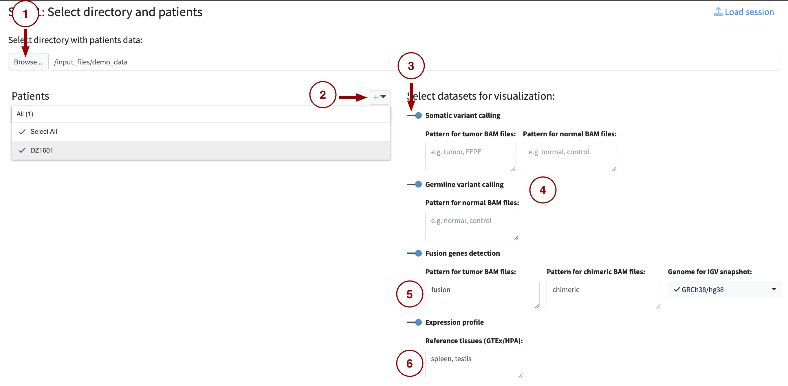

--- 
title: "SeqUIaSCOPE Documentation"
author: "Kateřina Jurásková"
date: "`r Sys.Date()`"
site: bookdown::bookdown_site
documentclass: book
output:
  bookdown::bs4_book:
    bootswatch: dark
    css: "custom-styles.css"

---

# Introduction {-}

SeqUIaSCOPE is an open-source web application designed for routine clinical oncology diagnostics through patient-centric integration and visualization of annotated genomic variants, fusion events, and expression profiles. It includes embedded genome browsing, pathway-level interpretation, and customizable reporting. The patient-centric design supports single-patient diagnosis while allowing multi-patient data management. SeqUIaSCOPE is designed for secure local or cluster-based deployment using Docker or Kubernetes, ensuring that all patient data remains within institutional infrastructure.

## Live demo  {-}
We are hosting a live demo of SeqUIaSCOPE to showcase its capabilities and allow users to explore the platform in action.
**Access the demo at: [Live Demo](https://sequiascope.dyn.cloud.e-infra.cz/)**

::: {.alert .alert-warning style="margin-top: 0.5rem;"}
**Important Notes:**

- Demo data are anonymized and does not represent real clinical cases
- Some features may have limited functionality due to data sensitivity requirements
- Genome browsing is available only for the fusion gene dataset, limited to one specific fusion (KMT2A::MLLT3) and the immediate vicinity of its breakpoints
- While the demo runs the full version of SeqUIaScope, uploading your own data is not supported
- For production use with your own data, deploy SeqUIaSCOPE locally using Docker or on cluster using Helm chart
:::

### How to load demo data: {-}

```{r, echo=FALSE, out.width="100%"}

```

1. Select **demo_data** folder as a directory with patient data
2. Add patient name as **DZ1601**
3. Select all datasets (Somatic variant calling, Germline variant calling, Fusion gene detection and Expression profile).
4. Leave patterns for somatic and germline variants empty.
5. Fill fusion detection pattern for tumor BAM file as **fusion** and for chimeric BAM file as **chimeric**. Genome for IGV snapshot should be set to GRCh38/hg38
6. Fill reference tissues for expression profile as **spleen, testis**


---

# How to install and run {-}

SeqUIaSCOPE can be deployed in two ways:

- **On a cluster** using Kubernetes + Helm — suitable for shared or production environments
- **Locally** using Docker Compose — suitable for single-machine use

Full installation and setup instructions are available in the
[README on GitHub](https://github.com/BioIT-CEITEC/sequiascope).

